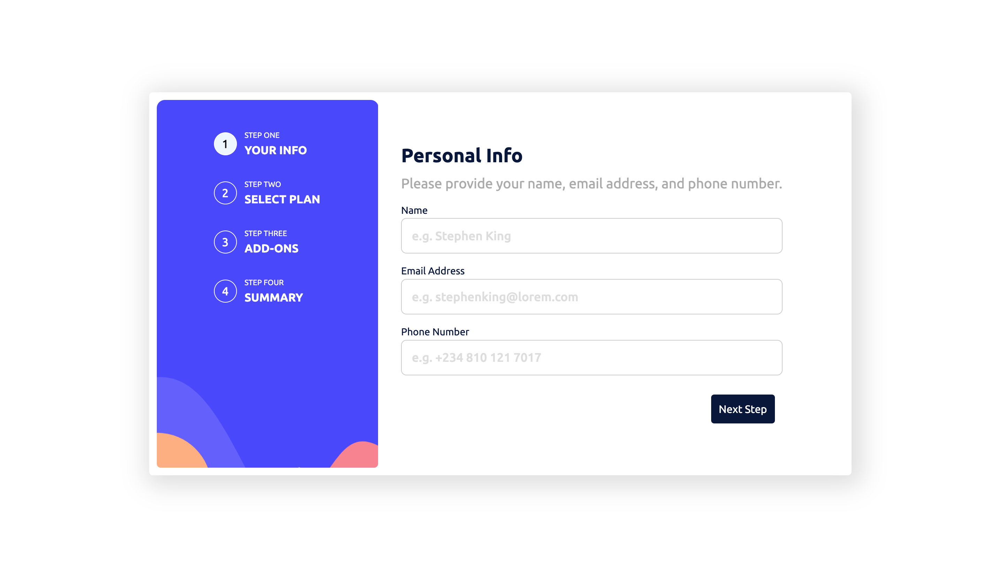
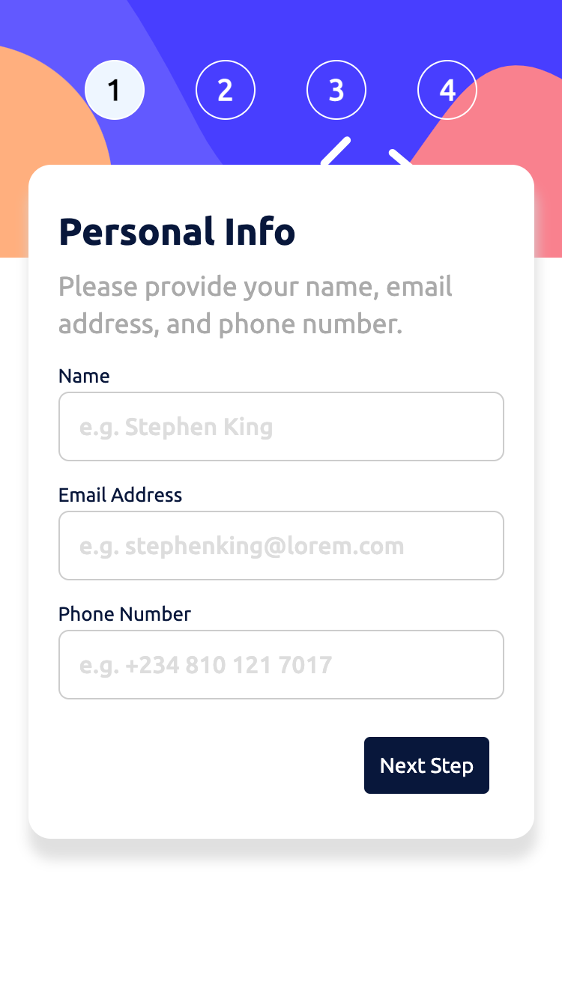

# Frontend Mentor - Multi-step form solution

This is a solution to the [Multi-step form challenge on Frontend Mentor](https://www.frontendmentor.io/challenges/multistep-form-YVAnSdqQBJ). Frontend Mentor challenges help you improve your coding skills by building realistic projects. 

## Table of contents

- [Overview](#overview)
  - [The challenge](#the-challenge)
  - [Screenshot](#screenshot)
  - [Links](#links)
- [My process](#my-process)
  - [Built with](#built-with)
  - [What I learned](#what-i-learned)
  - [Continued development](#continued-development)
  - [Useful resources](#useful-resources)
- [Author](#author)
- [Acknowledgments](#acknowledgments)

## Overview

This mini-project is a multi-step form which is ubuqitous in this day and age. It shows different stages of a form as you progress. It also prevents some invalid actions. I worked on this to improve my understanding of ReactJS as well as Redux Toolkit and Material UI components.

### The challenge

Users should be able to:

- Complete each step of the sequence
- Go back to a previous step to update their selections
- See a summary of their selections on the final step and confirm their order
- View the optimal layout for the interface depending on their device's screen size
- See hover and focus states for all interactive elements on the page
- Receive form validation messages if:
  - A field has been missed
  - The email address is not formatted correctly
  - A step is submitted, but no selection has been made

### Screenshot

### Links

- Solution URL: [Github Repo](https://github.com/OluwadaraDaily/multi-step-form)
- Live Site URL: [Add live site URL here](https://your-live-site-url.com)

## My process

### Built with

- Semantic HTML5 markup
- CSS custom properties
- Flexbox
- CSS Grid
- Mobile-first workflow
- [React](https://reactjs.org/) - JS library
- [Redux Toolkit](https://redux-toolkit.js.org/) - A State Management tool
- [Material UI](https://mui.com/) - UI Component Library

### What I learned

I learned a number of things during this project. They are as follows:

- [x] I learned how to use Redux Toolkit
- [x] I improved my understanding of React hooks
- [x] I learned how to use Material UI components and their API
- [x] I learned how to use Formik and Yup for form validation
- [x] I learned how to use the React Router v6

### Continued development

- An improvement that can be made to the project would be that buttons on each form stage to be disabled until the form passes the Yup validation
- Also, automated testing can be implemented.

### Useful resources

- [How to add custom font file to your React App?](https://dev.to/ziqinyeow/how-to-add-custom-font-file-to-your-react-app-31kb) - This helped me with adding the custom Ubuntu fonts.
- [How to Use Sass in React](https://www.makeuseof.com/react-sass-how-use) - This helped me to setup using SCSS in React.
- [React Router v6 in Depth](https://www.youtube.com/watch?v=OMQ2QARHPo0&list=PL4cUxeGkcC9iVKmtNuCeIswnQ97in2GGf) - This helped me to understand how the new React Router Works. It is a playlist on Youtube.
- [Redux and Redux Toolkit](https://www.youtube.com/watch?v=0awA5Uw6SJE&list=PLC3y8-rFHvwiaOAuTtVXittwybYIorRB3) - This helped me to understand Redux and Redux Toolkit.

## Author

- Website - [Oluwadara Oloye](https://github.com/OluwadaraDaily)
- Frontend Mentor - [@OluwadaraDaily](https://www.frontendmentor.io/profile/OluwadaraDaily)
- Twitter - [@OluwadaraDaily](https://www.twitter.com/OluwadaraDaily)

## Acknowledgments

- Huge shoutout to [Ndu](https://www.linkedin.com/in/yomi-ndu/) for helping me with a lot of logic and system design issues I had.